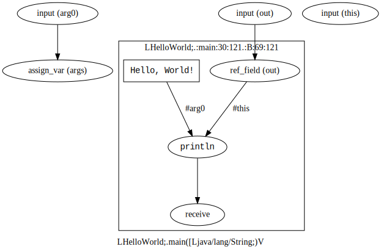

# FGyama

FGyama, or Flow Graph yama is a dataflow graph extractor for Java source code.

## What It Does

### Input

    public class HelloWorld {
        public static void main(String[] args) {
            System.out.println("Hello, World!");
        }
    }

### Output (XML)

    <?xml version="1.0" encoding="UTF-8"?><fgyama>
      <class extends="Ljava/lang/Object;" interface="false" name="LHelloWorld;" path="HelloWorld.java">
        <method abstract="false" name="LHelloWorld;.&lt;clinit&gt;()V" style="initializer">
          <ast end="123" start="0" type="55"/>
          <scope name="LHelloWorld;.&lt;clinit&gt;"/>
        </method>
        <method abstract="false" name="LHelloWorld;.main([Ljava/lang/String;)V" style="static">
          <ast end="121" start="30" type="31"/>
          <scope name="LHelloWorld;.:main:30:121">
            <node id="G1_main_N1" kind="input" ref="#arg0" type="[Ljava/lang/String;">
              <ast end="67" start="54" type="44"/>
            </node>
            <node id="G1_main_N2" kind="assign_var" ref="$LHelloWorld;.:main:30:121/$args" type="[Ljava/lang/String;">
              <ast end="67" start="54" type="44"/>
              <link src="G1_main_N1"/>
            </node>
            <node id="G1_main_N3" kind="input" ref="@Ljava/lang/System;/.out" type="Ljava/io/PrintStream;"/>
            <node id="G1_main_N4" kind="input" ref="#this" type="LHelloWorld;"/>
            <scope name="LHelloWorld;.:main:30:121.:B:69:121">
              <node id="G1_main_N5" kind="ref_field" ref="@Ljava/lang/System;/.out" type="Ljava/io/PrintStream;">
                <ast end="89" start="79" type="40"/>
                <link src="G1_main_N3"/>
              </node>
              <node data="Hello, World!" id="G1_main_N6" kind="value" type="Ljava/lang/String;">
                <ast end="113" start="98" type="45"/>
              </node>
              <node data="Ljava/io/PrintStream;.println(Ljava/lang/String;)V" id="G1_main_N7" kind="call" type="V">
                <ast end="114" start="79" type="32"/>
                <link label="#this" src="G1_main_N5"/>
                <link label="#arg0" src="G1_main_N6"/>
              </node>
              <node id="G1_main_N8" kind="receive" type="V">
                <ast end="114" start="79" type="32"/>
                <link src="G1_main_N7"/>
              </node>
            </scope>
          </scope>
        </method>
      </class>
    </fgyama>

### Output (Graphviz)

## Node types (kinds):

### Basic Operations

| Kind         | Data                | Input(s)                       |
| ------------ | ------------------- | -------------------------------|
| value        | Actual value        |                                |
| valueset     | Value count         | value0, value1, ...            |
| op_assign    | Assignment operator | L, R                           |
| op_prefix    | Prefix operator     | (default)                      |
| op_infix     | Infix operator      | L, R                           |
| op_postfix   | Postfix operator    | (default)                      |
| op_typecast  | Casting type        | (default)                      |
| op_typecheck | Checking type       | (default)                      |
| op_iter      |                     | (default)                      |
| ref_var      |                     | (default)                      |
| ref_array    |                     | (default), array, index        |
| ref_field    |                     | (default), obj                 |
| assign_var   |                     | (default)                      |
| assign_array |                     | (default), array, index        |
| assign_field |                     | (default), obj                 |

### Function Call

| Kind         | Data                | Input(s)                       |
| ------------ | ------------------- | -------------------------------|
| call         | Method IDs          | #this, #arg0, ..., Fields      |
| new          | Method ID           | #this, #arg0, ..., Fields      |
| input        |                     |                                |
| output       |                     | (default)                      |
| receive      |                     | (default), Fields              |
| throw        |                     |                                |
| catch        |                     |                                |

### Control Flow

| Kind         | Data                | Input(s)                       |
| ------------ | ------------------- | -------------------------------|
| join         |                     | cond, true, false              |
| begin        | Loop ID             | enter, repeat                  |
| end          | Loop ID             | (default), cond, _repeat       |
| repeat       | Loop ID             | (default), _end                |
| case         | Label count         | (default), match0, match1, ... |

## How to Build

### Prerequisites

  * Java/Ant
  * Eclipse JDT (automatically downloaded)
  * Graphviz http://graphviz.org/

### Compiling

    $ ant get-deps clean build

### Testing

    $ ./run.sh net.tabesugi.fgyama.Java2DF Class1.java Class2.java ... > out.graph
    $ python tools/graph2gv.py out.graph | dot -Tsvg > out.svg

## Development

### Coding style

    (c-add-style "me"
             '("Java"
               (c-offsets-alist . (
                                   (arglist-cont . c-lineup-argcont)
                                   (arglist-intro . +)
                                   ))
               ))

### TODOs

  * Lambdas.
  * Method references.
  * Exception chaining.
  * Vararg methods matching.
  * Handle consecutive SwitchCases.
  * Java language spec.: https://docs.oracle.com/javase/specs/
  * Moar unittests.
