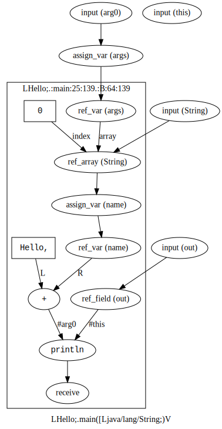

# FGyama

FGyama, or Flow Graph yama is a dataflow graph extractor for Java source code.

## What It Does

### Input

    public class Hello {
        public static void main(String[] args) {
    	String name = args[0];
            System.out.println("Hello, "+name);
        }
    }

### Output (SVG)

### Output (XML)

    <?xml version="1.0" encoding="UTF-8"?><fgyama>
      <class extends="Ljava/lang/Object;" interface="false" name="LHello;" path="Hello.java">
        <method abstract="false" name="LHello;.&lt;clinit&gt;()V" style="initializer">
          <ast end="141" start="0" type="55"/>
          <scope name="LHello;.&lt;clinit&gt;"/>
        </method>
        <method abstract="false" name="LHello;.main([Ljava/lang/String;)V" style="static">
          <ast end="139" start="25" type="31"/>
          <scope name="LHello;.:main:25:139">
            <node id="G1_main_N1" kind="input" ref="#arg0" type="[Ljava/lang/String;">
              <ast end="62" start="49" type="44"/>
            </node>
            <node id="G1_main_N2" kind="assign_var" ref="$LHello;.:main:25:139/$args" type="[Ljava/lang/String;">
              <ast end="62" start="49" type="44"/>
              <link src="G1_main_N1"/>
            </node>
            <node id="G1_main_N3" kind="input" ref="%Ljava/lang/String;" type="Ljava/lang/String;"/>
            <node id="G1_main_N4" kind="input" ref="@Ljava/lang/System;/.out" type="Ljava/io/PrintStream;"/>
            <node id="G1_main_N5" kind="input" ref="#this" type="LHello;"/>
            <scope name="LHello;.:main:25:139.:B:64:139">
              <node id="G1_main_N6" kind="ref_var" ref="$LHello;.:main:25:139/$args" type="[Ljava/lang/String;">
                <ast end="85" start="81" type="42"/>
                <link src="G1_main_N2"/>
              </node>
              <node data="0" id="G1_main_N7" kind="value" type="I">
                <ast end="87" start="86" type="34"/>
              </node>
              <node id="G1_main_N8" kind="ref_array" ref="%Ljava/lang/String;" type="Ljava/lang/String;">
                <ast end="88" start="81" type="2"/>
                <link label="array" src="G1_main_N6"/>
                <link label="index" src="G1_main_N7"/>
                <link src="G1_main_N3"/>
              </node>
              <node id="G1_main_N9" kind="assign_var" ref="$LHello;.:main:25:139.:B:64:139/$name" type="Ljava/lang/String;">
                <ast end="88" start="74" type="59"/>
                <link src="G1_main_N8"/>
              </node>
              <node id="G1_main_N10" kind="ref_field" ref="@Ljava/lang/System;/.out" type="Ljava/io/PrintStream;">
                <ast end="108" start="98" type="40"/>
                <link src="G1_main_N4"/>
              </node>
              <node data="Hello, " id="G1_main_N11" kind="value" type="Ljava/lang/String;">
                <ast end="126" start="117" type="45"/>
              </node>
              <node id="G1_main_N12" kind="ref_var" ref="$LHello;.:main:25:139.:B:64:139/$name" type="Ljava/lang/String;">
                <ast end="131" start="127" type="42"/>
                <link src="G1_main_N9"/>
              </node>
              <node data="+" id="G1_main_N13" kind="op_infix" type="Ljava/lang/String;">
                <ast end="131" start="117" type="27"/>
                <link label="L" src="G1_main_N11"/>
                <link label="R" src="G1_main_N12"/>
              </node>
              <node data="Ljava/io/PrintStream;.println(Ljava/lang/String;)V" id="G1_main_N14" kind="call" type="V">
                <ast end="132" start="98" type="32"/>
                <link label="#this" src="G1_main_N10"/>
                <link label="#arg0" src="G1_main_N13"/>
              </node>
              <node id="G1_main_N15" kind="receive" type="V">
                <ast end="132" start="98" type="32"/>
                <link src="G1_main_N14"/>
              </node>
            </scope>
          </scope>
        </method>
      </class>
    </fgyama>

## Node types (kinds):

### Basic Operations

| Kind         | Data                | Input(s)                       |
| ------------ | ------------------- | -------------------------------|
| value        | Actual value        |                                |
| valueset     | Value count         | value0, value1, ...            |
| op_assign    | Assignment operator | L, R                           |
| op_prefix    | Prefix operator     | (default)                      |
| op_infix     | Infix operator      | L, R                           |
| op_postfix   | Postfix operator    | (default)                      |
| op_typecast  | Casting type        | (default)                      |
| op_typecheck | Checking type       | (default)                      |
| op_iter      |                     | (default)                      |
| ref_var      |                     | (default)                      |
| ref_array    |                     | (default), array, index        |
| ref_field    |                     | (default), obj                 |
| assign_var   |                     | (default)                      |
| assign_array |                     | (default), array, index        |
| assign_field |                     | (default), obj                 |

### Function Call

| Kind         | Data                | Input(s)                       |
| ------------ | ------------------- | -------------------------------|
| call         | Method IDs          | #this, #arg0, ..., Fields      |
| new          | Method ID           | #this, #arg0, ..., Fields      |
| input        |                     |                                |
| output       |                     | (default)                      |
| return       |                     | (default)                      |
| receive      |                     | (default), Fields              |
| throw        |                     |                                |
| catch        |                     |                                |

### Control Flow

| Kind         | Data                | Input(s)                       |
| ------------ | ------------------- | -------------------------------|
| join         |                     | cond, true, false              |
| begin        | Loop ID             | enter, repeat                  |
| end          | Loop ID             | (default), cond, _repeat       |
| repeat       | Loop ID             | (default), _end                |
| case         | Label count         | (default), match0, match1, ... |

## How to Build

### Prerequisites

  * Java/Ant
  * Eclipse JDT (automatically downloaded)
  * Graphviz http://graphviz.org/

### Compiling

    $ ant get-deps clean build

### Testing

    $ ./run.sh net.tabesugi.fgyama.Java2DF ./tests/Hello.java > Hello.graph
    $ python tools/graph2gv.py Hello.graph | dot -Tsvg > Hello.svg

## How to Use

    XmlExporter exporter = new XmlExporter(System.out);
    Java2DF converter = new Java2DF();
    converter.loadDefaults();       // Load the standard classes.
    converter.loadJarFile("path/to/my.jar");  // Add a jar.
    converter.addSourceFile("Hello.java");    // Add a source code.
    for (DFSourceKlass klass : converter.getSourceKlasses()) {
        // Perform analysis for every class.
        converter.analyzeKlass(exporter, klass, false);
    }
    exporter.close();

## Development

### Coding style

    (c-add-style "me"
             '("Java"
               (c-offsets-alist . (
                                   (arglist-cont . c-lineup-argcont)
                                   (arglist-intro . +)
                                   ))
               ))

### TODOs

  * Handle consecutive SwitchCases.
  * Correct local scope handling.
  * Java language spec.: https://docs.oracle.com/javase/specs/
  * Moar unittests.
